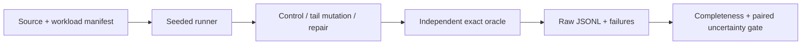

# Qualification and Regression Kit

[](https://github.com/JDinSeattle/qualification-regression-kit/actions/workflows/ci.yml)

A regression qualification harness around a C++17 CPU GEMM operator adapted from the boundary workload contract of [GEMM Lab](https://github.com/JDinSeattle/llm-gemm-qualification-lab). It makes a deliberately injected K-tail defect fail reliably, minimizes it to 1×1×1, then verifies the repair against an independent exact integer oracle.

The candidate truncates K to an 8-element boundary. The control uses an i-j-k loop; the repaired version uses an i-k-j loop that retains the tail. This is our mutation fixture, **not a new bug discovered in GEMM Lab**, and these CPU measurements are independent of that repository's historical CUDA results.

The recorded matrix has 54 executions across six shapes, three input seeds and three variants. Nine candidate executions fail as expected; all 36 control/repaired executions pass. A separate 20-pair study retains every timing sample and uses a seeded bootstrap with a 5% practical threshold. An ambiguous comparison returns `uncertain`.

## Reproduce

```bash
git clone https://github.com/JDinSeattle/qualification-regression-kit.git
cd qualification-regression-kit
make verify
python3 evidence.py .runs/latest
```

`make test` runs focused contract regressions. `make verify` also builds and executes real integration/fault experiments. A prior `.runs/latest` is moved to a timestamped archive before a fresh run; nonempty output directories outside `.runs` are never overwritten. GitHub Actions executes the same entry point and uploads evidence even on failure.

The checked-in [local evidence](evidence/local/) has raw records, a source/environment manifest and SHA-256 artifact hashes. Verify it with `make evidence-check`. [Measured results](docs/results.md), [engineering notes](docs/engineering.md), and [interview guide](docs/interview.md) explain what can be claimed.

## System



`qualify.py` owns classification and uncertainty; `src/gemm.cpp` owns computation; `scripts/validate.py` owns the experiment, minimization and evidence recording. The oracle uses integer dot products divided once by 64; the worker accumulates double row operations. Generated inputs have exact binary representations, so equality is intentional for this bounded numerical domain.

## Support and evidence limits

Linux x86_64, Python ≥3.10, g++/binutils; no Python dependencies. The six shapes include exact GEMM Lab unit boundaries and separately identified downscaled CPU performance shapes. Float64 generated inputs only; no claim about FP16/BF16 error, CUDA synchronization, GPU device timing, multi-GPU behavior or model quality. Kernel timing excludes allocation and serialization, while subprocess latency includes startup. Shared host, no pinned CPU frequency, 20 paired repetitions: report uncertainty and full samples, never a single best run.


**Role evidence:** SDET · performance qualification · developer technology. This is an author-operated engineering lab. AI-assisted implementation is disclosed; ownership means understanding, reproducing and explaining the code and measurements. No external customer, production operation, upstream contribution or independent reviewer is implied.

MIT licensed. Operator source vendoring, where present, is recorded in `vendor/lock.json`; upstream workload attribution, where present, is in `upstream/`.
