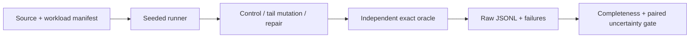

# Qualification and Regression Kit

## Experience Bank results

The results below are the owner-confirmed results from a separate cloud-hosted test environment, synchronized from the Experience Bank. The experiments retain the local, synthetic, simulator, CPU, Docker and single-host boundaries stated in each result; cloud hosting does not imply production deployment. This repository refresh does not represent a rerun of those measurements. Earlier dated evidence below remains tied to its own source, configuration and denominator.

1. Ran a 54-execution CPU qualification matrix (6 shapes × 3 seeds × 3 variants) against an independent oracle: control passed 18 and repaired passed 18, while the K-tail mutant failed 9 times on the three shapes whose K is not a multiple of 4 and passed the other 9 (K-divisible) runs as positive controls.

2. Reduced a failing case by deleting rows, columns and K ranges while preserving the wrong answer, re-executing the reference and the candidate at every reduction step, until A=[2], B=[3] with reference 6 and mutant 0; infrastructure errors and parse failures do not satisfy the reduction predicate and are never counted as smaller counterexamples.

3. Enforced strict protocol typing — type(protocol) is int and protocol==1, with separate array-length, element-type and finiteness checks — after the old value-only comparison accepted JSON true as protocol 1 in Python; all 6 injections (true, 1.0, missing field, wrong length, NaN, string number) are rejected while the integer 1 control passes.

4. Hardened worker execution with a new session per worker, SIGKILL to the process group, direct-child reaping and retained pre-timeout diagnostics; a real grandchild's delayed marker is never written in the 12-case local regression suite, and the cleanup promise covers cooperative descendants that stay inside the session/process group.

5. Kept performance measurement uncertain rather than flattering: 5 warmups then 20 random-order paired samples with recorded seeds, each accumulating 1,000 calls to amortize timer overhead and an output checksum to prevent optimizer elimination; the repaired/control geomean speedup is 1.02 with seeded paired bootstrap 95% CI [0.98, 1.06], the decision is uncertain, and UBSan-instrumented runs stay out of the performance samples.

See the [implementation and reproduction map](docs/experience-bank-alignment.md) for per-result source/tests, reproduction commands and limitations.

[](https://github.com/JDinSeattle/qualification-regression-kit/actions/workflows/ci.yml)

A regression qualification harness around a C++17 CPU GEMM operator adapted from the boundary workload contract of [GEMM Lab](https://github.com/JDinSeattle/llm-gemm-qualification-lab). It makes a deliberately injected K-tail defect fail reliably, minimizes it to 1×1×1, then verifies the repair against an independent exact integer oracle.

The candidate truncates K to an 4-element boundary. The control uses an i-j-k loop; the repaired version uses an i-k-j loop that retains the tail. This is our mutation fixture, **not a new bug discovered in GEMM Lab**, and these CPU measurements are independent of that repository's historical CUDA results.

The recorded matrix has 54 executions across six shapes, three input seeds and three variants. Nine candidate executions fail as expected; all 36 control/repaired executions pass. A separate 20-pair study retains every timing sample and uses a seeded bootstrap with a 5% practical threshold. An ambiguous comparison returns `uncertain`.

## September 2026 maintenance

The old output gate treated JSON true as integer protocol version 1. The new gate requires exact integer protocol and typed finite measurements. Each worker starts a new process session; a timeout kills its process group, reaps the direct child, and preserves partial stdout/stderr. A real child/grandchild regression checks that the descendant cannot write its delayed marker.

[Design, acceptance tests and limits](docs/refresh-20260907.md) · [Current measured results](docs/refresh-results-20260907.md). CI repeats validation on Python 3.12 and 3.14.7.

## Reproduce

```bash
git clone https://github.com/JDinSeattle/qualification-regression-kit.git
cd qualification-regression-kit
make verify
python3 evidence.py .runs/latest
```

`make test` runs focused contract regressions. `make verify` also builds and executes real integration/fault experiments. A prior `.runs/latest` is moved to a timestamped archive before a fresh run; nonempty output directories outside `.runs` are never overwritten. GitHub Actions executes the same entry point and uploads evidence even on failure.

The checked-in [local evidence](evidence/local/) has raw records, a source/environment manifest and SHA-256 artifact hashes. Verify it with `make evidence-check`. [Measured results](docs/results.md), [engineering notes](docs/engineering.md), and [interview guide](docs/interview.md) explain what can be claimed.

## System


```mermaid
flowchart LR
  M[Source + workload manifest] --> R[Seeded runner]
  R --> C[Control / tail mutation / repair]
  C --> O[Independent exact oracle]
  O --> J[Raw JSONL + failures]
  J --> G[Completeness + paired uncertainty gate]
```

`qualify.py` owns classification and uncertainty; `src/gemm.cpp` owns computation; `scripts/validate.py` owns the experiment, minimization and evidence recording. The oracle uses integer dot products divided once by 64; the worker accumulates double row operations. Generated inputs have exact binary representations, so equality is intentional for this bounded numerical domain.

## Support and evidence limits

Linux x86_64, Python ≥3.10, g++/binutils; no Python dependencies. The six shapes include exact GEMM Lab unit boundaries and separately identified downscaled CPU performance shapes. Float64 generated inputs only; no claim about FP16/BF16 error, CUDA synchronization, GPU device timing, multi-GPU behavior or model quality. Kernel timing excludes allocation and serialization, while subprocess latency includes startup. Shared host, no pinned CPU frequency, 20 paired repetitions: report uncertainty and full samples, never a single best run.


**Role evidence:** SDET · performance qualification · developer technology. This is an author-operated engineering lab. AI-assisted implementation is disclosed; ownership means understanding, reproducing and explaining the code and measurements. No external customer, production operation, upstream contribution or independent reviewer is implied.

MIT licensed. Operator source vendoring, where present, is recorded in `vendor/lock.json`; upstream workload attribution, where present, is in `upstream/`.
