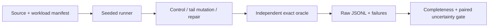

# Engineering contract

`qualify.py` owns classification and uncertainty; `src/gemm.cpp` owns computation; `scripts/validate.py` owns the experiment, minimization and evidence recording. The oracle uses integer dot products divided once by 64; the worker accumulates double row operations. Generated inputs have exact binary representations, so equality is intentional for this bounded numerical domain.

## Compatibility and limits

Linux x86_64, Python ≥3.10, g++/binutils; no Python dependencies. The six shapes include exact GEMM Lab unit boundaries and separately identified downscaled CPU performance shapes. Float64 generated inputs only; no claim about FP16/BF16 error, CUDA synchronization, GPU device timing, multi-GPU behavior or model quality. Kernel timing excludes allocation and serialization, while subprocess latency includes startup. Shared host, no pinned CPU frequency, 20 paired repetitions: report uncertainty and full samples, never a single best run.

